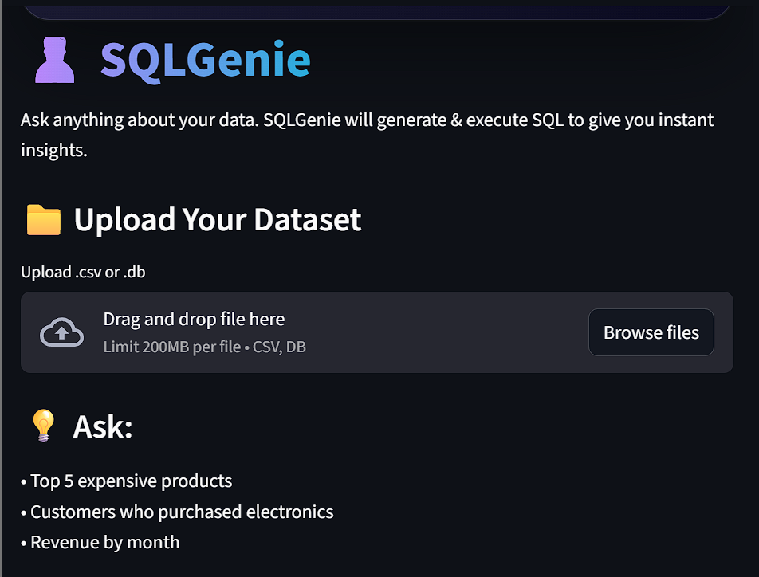
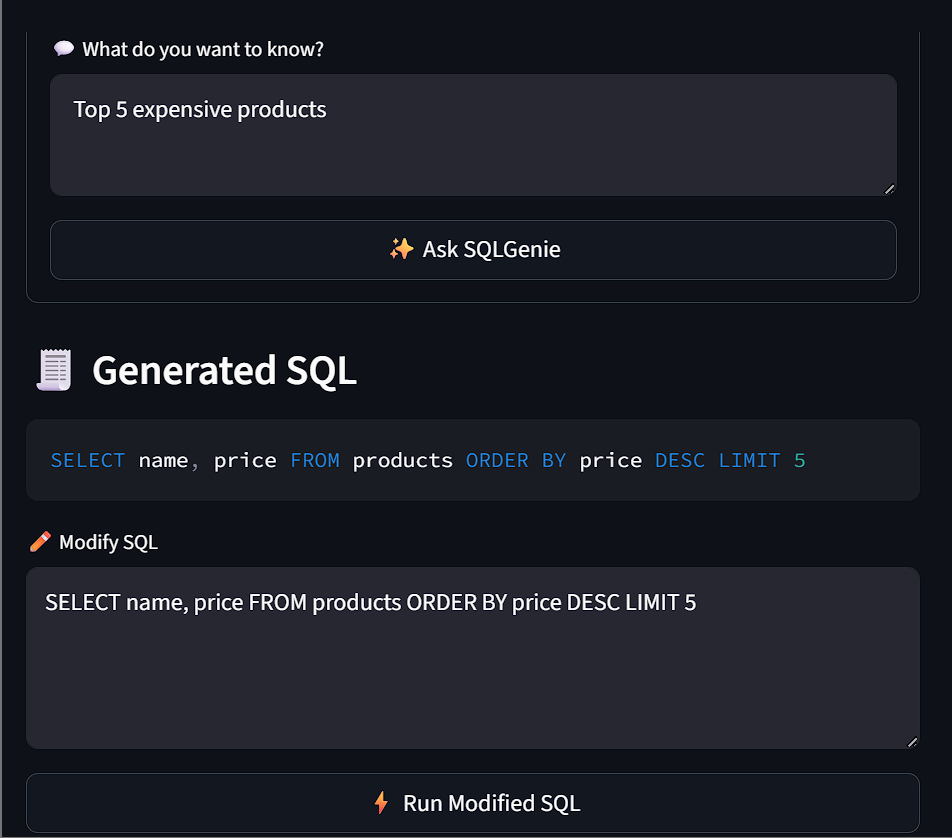
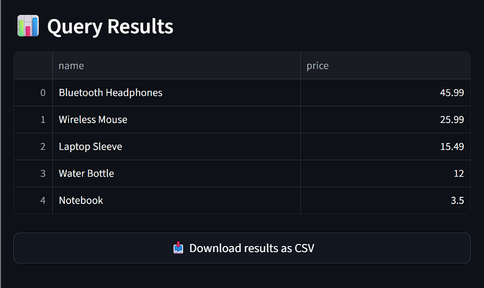

# SQLGenie ✨

_A modern, friendly AI-powered Text → SQL analytics platform — convert plain English into JOIN-aware, repairable SQLite queries and get instant tabular insights via a Streamlit UI._

  ]

---

Quick tagline: Ask questions in natural language — SQLGenie generates, repairs, executes, and exports SQL-powered insights.

---

## Table of Contents
- Features
- How It Works — Pipeline & Architecture
- Tech Stack
- Installation & Quick Start
- Configuration
- Usage Walkthrough
- Folder Structure
- Limitations
- Screenshots
- Troubleshooting
- Contributing
- License

---

## Features
- ✨ Natural-language → SQL conversion using Groq LLMs (via `langchain_groq`).
- 🔗 JOIN-aware SQL generation — uses schema metadata to suggest JOINs sensibly.
- 🛠 Automatic SQL repair loop — runtime errors are fed back to the LLM to obtain corrected SQL.
- 📁 Upload `.csv` and `.db` files in-app. CSVs are converted to a local SQLite DB automatically.
- ✍️ Displays generated SQL and allows inline editing before execution.
- ▶️ Manual SQL execution with instant results rendering.
- 📥 Export query results to CSV.
- 🧭 Clean, modern Streamlit interface for fast interactive exploration.

---

---

## How it Works — Pipeline

SQLGenie's pipeline is designed to be simple, transparent, and resilient:

1. Schema Extraction  
   - The app inspects the active SQLite database and extracts table + column metadata.

2. LLM Prompt (Text → SQL)  
   - A structured system + user prompt is sent to the Groq LLM requesting valid SQLite SQL. The system prompt enforces "return raw SQL only."

3. SQL Cleaning  
   - The LLM response is cleaned: remove think tags, code fences, backticks, and stray whitespace.

4. SQL Execution  
   - The cleaned SQL is executed against the active SQLite DB.

5. Auto-Repair (if execution errors)  
   - If execution fails, the error message + schema + user prompt are re-sent to the LLM requesting a repaired SQL query. The repaired SQL is executed automatically.

6. Result Rendering  
   - Returned rows are shown as a `pandas` DataFrame in Streamlit and can be downloaded as CSV.

Visual pipeline (Mermaid):

\`\`\`mermaid
flowchart LR
  A[User Prompt] --> B[Schema Extraction]
  B --> C[LLM Prompt (Groq)]
  C --> D[SQL Cleaning]
  D --> E{Execute SQL}
  E -->|Success| F[Render Results + Export]
  E -->|Error| G[Auto-Repair Prompt]
  G --> C
\`\`\`

---

## Architecture Overview

- Frontend (Streamlit) — `frontend.py`
  - Upload UI, query form, generated SQL display and editor, manual execution, result rendering & download.
- Core pipeline — `main.py`
  - Schema extraction, prompt templating, LLM invocation, response cleaning, repair loop.
- Data storage — SQLite files (`amazon.db` by default, or `uploaded_database.db` for uploads).
- LLM backend — Groq via `langchain_groq.ChatGroq` used to generate and repair SQL.

---

## Tech Stack
- Python 3.11
- Streamlit — UI
- SQLite — local DB
- SQLAlchemy — schema inspection
- Groq LLMs via `langchain_groq` — text→SQL & repair
- pandas — CSV import & DataFrame display
- python-dotenv — .env config

Key files:
- `frontend.py` — Streamlit app and UI logic
- `main.py` — text → SQL pipeline, LLM integration, repair loop
- `create_database.py` — optional DB helpers (if present)
- `images/` — screenshots used in this README

---

## Installation & Quick Start (Windows — cmd.exe)

1. Clone the repo:
\`\`\`batch
git clone https://github.com/niti/sqlgenie.git
cd sqlgenie
\`\`\`

2. Create and activate a virtual environment:
\`\`\`batch
python -m venv myenv
myenv\Scripts\activate
\`\`\`

3. Install dependencies:
- If a `requirements.txt` exists:
\`\`\`batch
pip install -r requirements.txt
\`\`\`
- Or install core packages:
\`\`\`batch
pip install streamlit sqlalchemy python-dotenv pandas langchain langchain-groq
\`\`\`

4. Configure environment:
Create a `.env` file in the project root with your Groq API key:
\`\`\`text
GROQ_API_KEY=sk-xxxx-your-groq-key-xxxx
\`\`\`

5. Run the app:
\`\`\`batch
streamlit run frontend.py
\`\`\`
Open the URL printed by Streamlit (typically http://localhost:8501).

---

## Configuration

- `.env` variables:
  - `GROQ_API_KEY` — REQUIRED. Your Groq API key to call the Groq LLMs.

- Default DB:
  - The app defaults to `amazon.db`. Upload a `.db` or `.csv` in the UI to replace the active DB with `uploaded_database.db`.

- Model settings:
  - The model and temperature are set in `main.py` where `ChatGroq` is instantiated. Adjust if you have different Groq models or preferences.

Security note:
- Never commit `.env` or API keys. The app executes raw SQL; keep datasets and access permissions in mind.

---

## Usage Walkthrough

1. Upload a dataset  
   - Use the right-side upload card to upload a `.db` or `.csv`.
   - For CSV, the file is converted and saved as `uploaded_database.db`. The table name is the CSV filename (without extension).

2. Ask a question  
   - Enter a natural language question in the query box (e.g., "Top 5 most expensive products and their categories") and press "✨ Ask SQLGenie".

3. Inspect generated SQL  
   - Generated SQL appears in the editor; review and optionally edit.

4. Run modified SQL  
   - Click "⚡ Run Modified SQL" to execute your manual edits.

5. Export results  
   - Download the DataFrame as CSV via the "📥 Download results as CSV" button.

---

## Folder Structure

\`\`\`
.
├─ images/
│  ├─ home.png
│  ├─ query.png
│  ├─ sql_editor.png
│  ├─ results.png
│  └─ upload.png
├─ frontend.py
├─ main.py
├─ create_database.py    # optional helper
├─ requirements.txt      # optional
├─ .env.example
└─ README.md
\`\`\`

---

## Limitations
- Requires internet + valid Groq API key. Not usable offline.
- LLMs may return imperfect SQL; the repair loop reduces failures but cannot guarantee correctness for all complex queries.
- May produce destructive SQL (\`DELETE\`, \`DROP\`) — review SQL before executing if you're not in a disposable DB.
- Designed for small-to-medium SQLite datasets — not optimized for large-scale data warehouses.
- Relationship inference is heuristic (based on column names); explicit foreign-key metadata is not required but would improve JOIN accuracy.

---
## Screenshots

Home / Dashboard  

 

 

## Roadmap
Planned improvements:
- Read-only mode and role-based execution controls.
- Automatic foreign-key inference to improve JOIN suggestions.
- Support for additional SQL dialects (Postgres, MySQL).
- Query history, saved queries, and audit logs.
- Add sample/demo `amazon.db` and Docker image for quick demos.
- CI, tests, and more robust error logging.

---

## Troubleshooting

- "No GROQ_API_KEY found"  
  - Create `.env` with `GROQ_API_KEY=...` and restart Streamlit.

- LLM returns markdown or code fences  
  - `main.py` already strips common artifacts. Inspect raw LLM output by temporarily logging the response in `text_to_sql()` if needed.

- SQL execution fails  
  - SQLGenie will attempt auto-repair automatically. If repair fails, copy the SQL into the editor and debug manually.

- CSV upload problems  
  - Ensure the CSV header row is clean (no duplicated column names). Pre-clean with pandas locally if necessary.

- Streamlit port conflict  
  - Run Streamlit on a different port:
\`\`\`batch
streamlit run frontend.py --server.port 8502
\`\`\`

---

## Contributing

Contributions are welcome — features, bug fixes, docs, and tests.

- Fork the repo
- Create a branch: \`git checkout -b feat/my-feature\`
- Commit changes, run the app locally, and add tests where applicable
- Open a Pull Request with a clear description

Please include reproducible steps for any bug fixes and be mindful not to commit secrets.

---

## License

SQLGenie is released under the MIT License. 

---

## Thank you!
